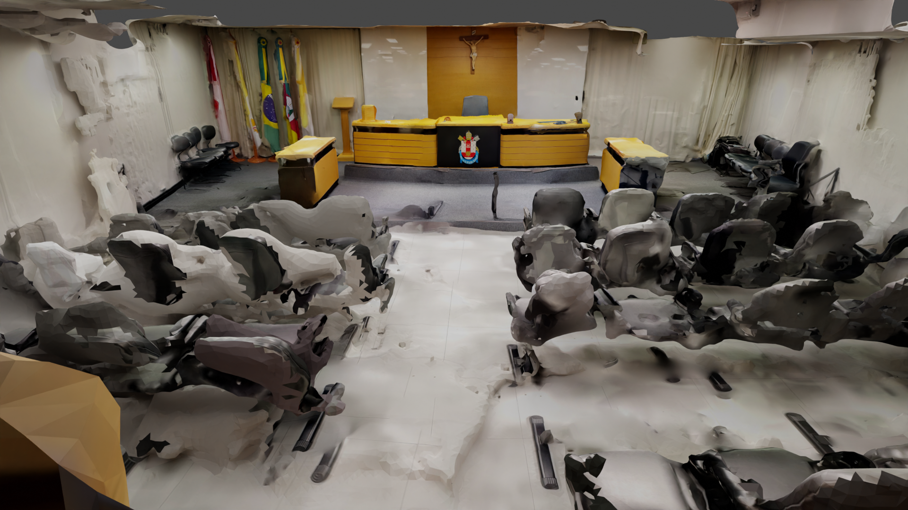
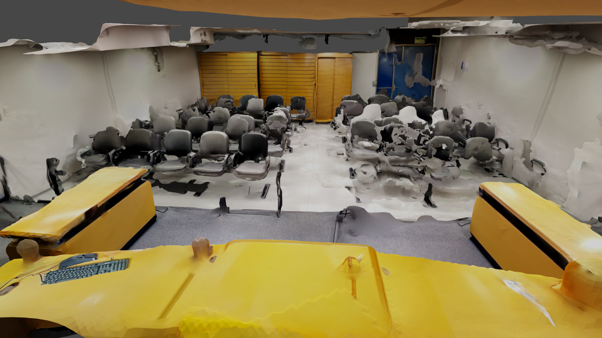
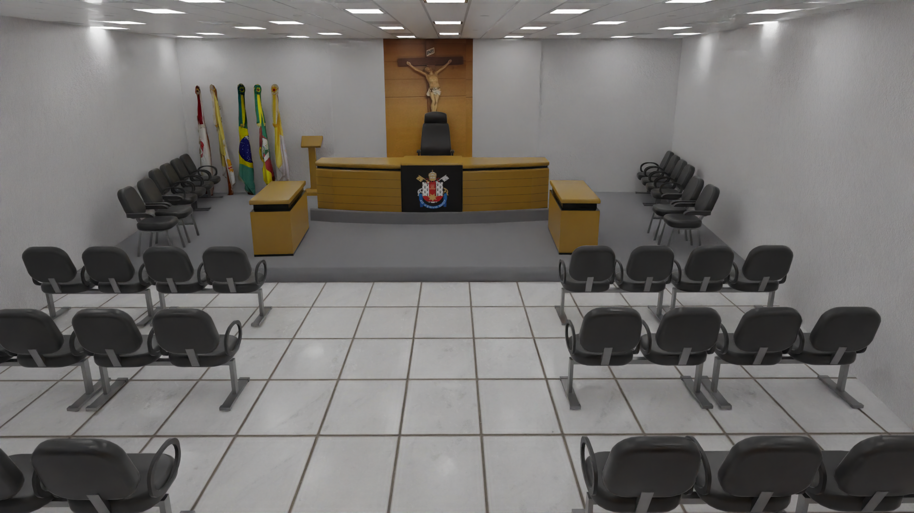
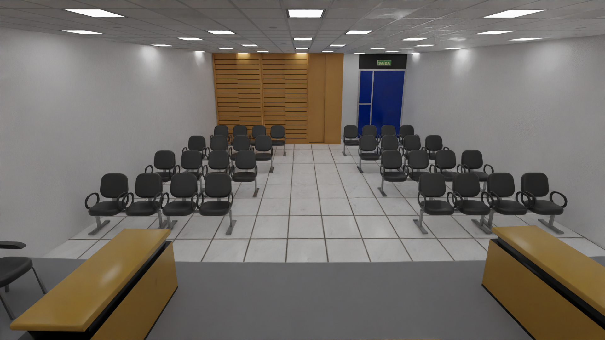

# Projeto Tribunal 3D PUCRS 

<h3>Contexto:</h3>
Neste projeto realizei a reconstrução de um modelo 3D gerado por escaneamento. A ideia central do projeto era ter o ambiente 3D do tribunal o mais parecido com a realidade para posteriormente ser usado pelos alunos do curso de direito da PUCRS em uma simulação de julgamento virtual, como o metaverso.

<h3>Recebi o modelo da seguinte forma:</h3>

Utilizei o modelo acima como guia. Os únicos itens que foi possível aproveitar no novo modelo foram as bandeiras e a imagem do cristo.

<h3>Abaixo estão imagens do novo modelo, feito no Blender:</h3>

<h3>Mozilla Hubs:</h3>
Depois de pronto, o modelo foi colocado na plataforma <a href="https://hubs.mozilla.com/">Mozilla Hubs</a>, que era uma plataforma interativa de realidade virtual (foi encerrada). 

<h3>Especificações do projeto no Blender:</h3>

- Objetos: 302
- Vértices: 98.311
- Arestas: 192.841
- Faces: 95.064
- Triângulos: 192.523
